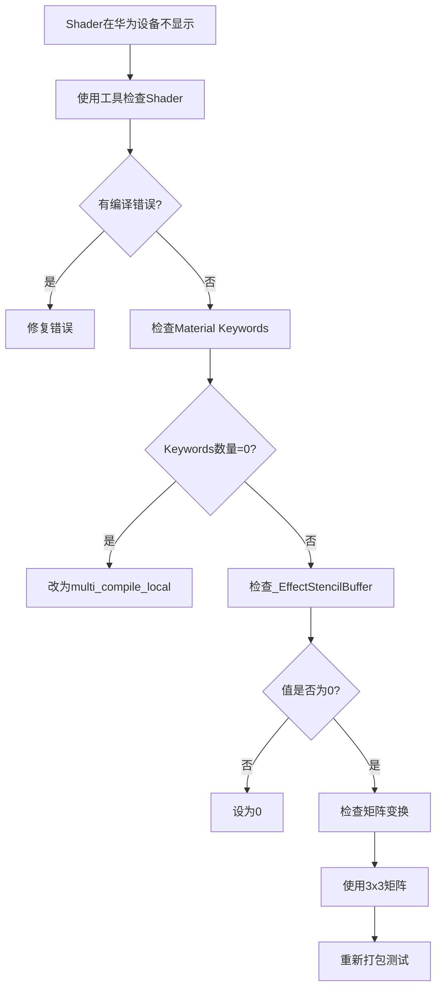

# Shader变体检测器使用指南

## 问题背景

### 华为设备Shader不显示问题

在Unity移动开发中，常遇到Shader在华为等特定设备上不显示的问题，原因包括：

1. **Shader变体被剥离**
   - `shader_feature_local` 只编译Material使用的变体
   - 华为应用商店打包可能剥离未使用的变体
   - 运行时切换Keyword时找不到对应变体

2. **矩阵变换不兼容**
   - `UNITY_MATRIX_M` 在某些Mali GPU上不可靠
   - 方向变换错误使用 `w=1.0`（应为 `w=0`）

3. **动态Stencil不支持**
   - 某些设备不支持运行时Stencil Compare
   - 必须使用固定值

4. **精度问题**
   - Mali-G51/G52对half精度计算有bug
   - 需要强制使用float精度

---

## 解决方案

### 1. 修改Shader变体声明

```hlsl
// ❌ 会被剥离
#pragma shader_feature_local _USERIM_ON
#pragma shader_feature_local _BASEUV_DEFAULT _BASEUV_FLIPBOOKBLENDING

// ✅ 强制编译所有变体
#pragma multi_compile_local __ _USERIM_ON
#pragma multi_compile_local _BASEUV_DEFAULT _BASEUV_FLIPBOOKBLENDING
```

**影响**：
- 包体增加约100-200KB
- 所有设备都能正确渲染

### 2. 修正矩阵变换

```hlsl
// ❌ 原代码 - w=1.0错误
half3 worldTangent = mul(UNITY_MATRIX_M, float4(tangent.xyz, 1.0)).xyz;

// ✅ 修正 - 使用3x3矩阵（自动w=0）
half3 worldTangent = mul((float3x3)UNITY_MATRIX_M, tangent.xyz);
```

### 3. 检查Stencil配置

在Material Inspector中：
```
_EffectStencilBuffer = 0  // 设为固定值
```

### 4. 强制精度（如果需要）

在Shader顶部添加：
```hlsl
HLSLINCLUDE
#pragma target 3.0
#define half float
#define half2 float2
#define half3 float3
#define half4 float4
ENDHLSL
```

---

## 工具使用

### 启动工具

Unity菜单 → `Tools → Shader变体检测器`

### 功能1：检查Shader编译状态

**步骤**：
1. 拖入目标Shader到「目标Shader」栏
2. 点击「检查Shader编译状态」

**输出**：
- ✅ Shader支持当前平台
- ✅ Shader编译无错误
- 📊 预估变体数量: 96

### 功能2：检查Material Keywords

**步骤**：
1. 拖入目标Material到「目标Material」栏
2. 点击「检查Material启用的Keywords」

**输出**：
```
📦 Material: MyEffect
🎨 Shader: Art/Effect/Transparent
✅ 启用的Keywords (2):
  • _USERIM_ON
  • _BASEUV_DEFAULT

📋 关键属性值:
  _EffectStencilBuffer = 0      ✅ 正确
  _BlendDst = 1
  _ZWriteMode = 0

🖼️ 使用的贴图:
  _BaseMap = Texture01
  _MaskMap = NULL              ⚠️ 未绑定
```

### 诊断建议

工具会自动检测问题并提供建议：

| 检测项 | 正常 | 异常 | 建议 |
|--------|------|------|------|
| **Keywords数量** | 1-3个 | 0个 | 变体被剥离，改用multi_compile |
| **_EffectStencilBuffer** | 0 | 非0 | 设为0避免动态Stencil问题 |
| **贴图绑定** | 有贴图 | NULL | 检查贴图路径 |
| **编译错误** | 0 | >0 | 查看错误详情 |

---

## 完整排查流程



---

## 常见问题

### Q1: 工具显示"预估变体数量96"，实际编译了多少？

A: `multi_compile_local` 会编译所有组合（96个），`shader_feature_local` 只编译Material使用的（1-5个）。

### Q2: 改为multi_compile后包体增加多少？

A: 约100-200KB，现代游戏可忽略。

### Q3: 如何在不打包情况下测试华为设备？

A: 使用Unity Remote 5或华为云真机服务。

### Q4: 工具提示"当前Unity版本无法获取变体数量"？

A: 正常现象，工具会使用预估计算代替。

---

## 技术原理

### shader_feature vs multi_compile

| 特性 | shader_feature | multi_compile |
|------|----------------|---------------|
| **编译时机** | 仅编译Material使用的 | 编译所有组合 |
| **包体大小** | 小 | 大 |
| **运行时切换** | 可能失败（变体未编译） | 安全 |
| **适用场景** | 固定配置 | 运行时动态切换 |

### 华为Mali GPU特性

- 对 `UNITY_MATRIX_M` 支持不完整
- 动态Stencil Compare可能失败
- half精度在某些型号有bug
- Shader变体检查更严格

---

## 更新记录

- **2026-03-04**: 初始版本，解决华为设备不显示问题
